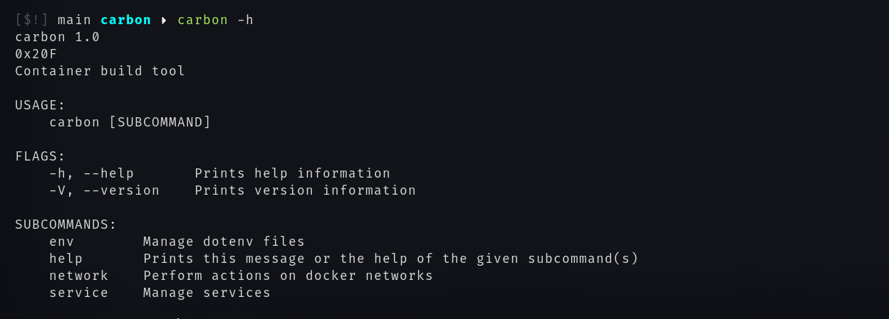
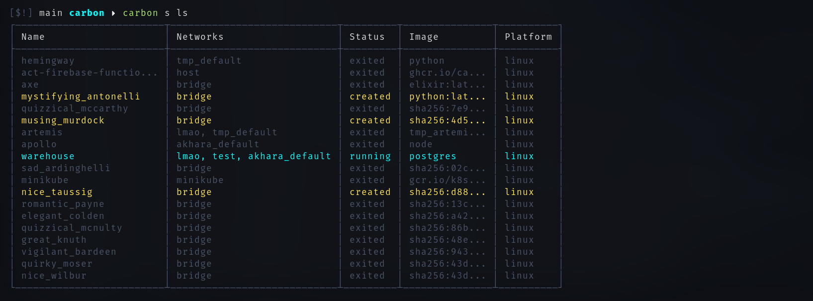
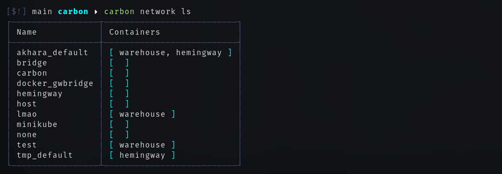
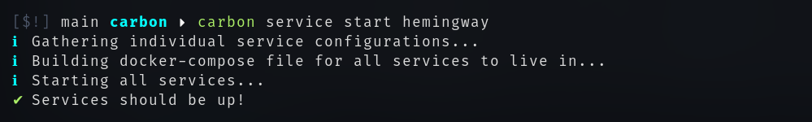

	

docker abstraction layer with added flair

 

_Fast travel_:
- [Tips](#Tips)
- [Contributing](#Contributing)
- [Help](#Getting-help)

 

This tool started its life as a way to make developing multiple smaller projects/apis 
that need to interact with each other a lot easier by allowing each project to define how
it should be spun up as a container. Dare I say it's now possible to use it to _somewhat_
orchestrate how smaller networks of services work. For when you don't need the scalability of
Kubernetes I guess.

 

### What it is
The gist of it all is that instead if having a big `docker-compose.yml` full of services,
you have multiple smaller files spread out throughout your projects. 

Big compose files become unwieldy pretty quick while dependencies between services increase.
Carbon aims to somewhat alleviate that by giving each service responsibility over itself
instead of a centralized file.

 

### How it works
1. Carbon needs a `.env` file to function properly. That's where you define where
all your mini-projects are located. If working in an organization, all projects within that organization are (hopefully) in the same directory. That's the directory you tell Carbon to look into by setting the `PROJECTS_DIRECTORY` environment variable.
If using a `.env` file, all of those variables will also be provided to the 
`carbon.yml` files  (read below to find out about those). You can add a `.env` file to Carbon using the `carbon env add <file_path> <alias>` command.

2. Each service has the _right_ to define a `carbon.yml` file within its directory. This file
is allowed to contain exactly what would have been written in the `service:` block for a normal
`docker-compose.yml` file. This carbon file tells Carbon how to spin up said service.

3. Each service is also allowed to define a `carbon-isotope.yml` file within its directory. This file
can be used to house a second type of configuration for the service. I, personally, have been using this
to setup the exact same service, but with all of its ports exposed so that it can be used for development.

4. Once you've got your `.env` file ready, and one of your projects contains a `carbon.yml` file, you can start that service with `carbon service start <service_name>`. Keep in mind that Carbon will look at a directory named like the name you pass in. That's a current limitation: container names + directory names need to match up.

That's all the extra functionality that Carbon itself adds on top of docker compose. It does add some wrapper functionality to make using the docker cli a bit easier. Check the **Overrides** for that.

 

### Overrides
Docker things that carbon does as well, sometimes better.
- Commands return colored output/tables for a clearer understanding of what you're looking at.
- Carbon has a command for quickly starting a new service and immediately adding it to an existing docker network.
- Display information about networks
- Display information about containers
- Rebuild already running services on the fly. Useful when the image has been updated and it needs a hard reset. This does kill the service beforehand (for now at least).
- Easy management of environment variables
- Start services
- Stop services
- Create networks
- Remove networks
- Connect to networks
- ...and more

 

### Tips
Here're some bits of information that might come in handy:
- Multiple `.env` files can be used, since each file is given an alias when added it can also be set as _active_ later on. List all your `.env` files with `carbon env ls`. Carbon will always use the _active_ `.env` file.
- Each subcommand of Carbon has an alias as well (usually the first letter of the original command). `list` for example has `ls`.
- Service `start`, `stop`, `add`, and `rebuild` commands can all work on multiple services. You don't have to run the command multiple times, just once with everything. You can sort out the networks after the fact.

 

### Getting help
If something doesn't feel right when you really think it should, follow the checklist:
1. Did you look at the proper usage of a command by adding the `-h` flag? Example: `carbon service -h`.
2. Have you read the (very basic (sorry)) explanation of how everything is supposed to work? (defined above)
3. Rummage through the discussions and see if there is anything that might be related to your issue.

**Emergency**: If none of the above things help. **Please** start a discussion and tag a contributor. Don't jump directly to creating an issue since it might not really be an issue. Just poor documentation on our end, or just _not_ an actual feature.

 

### Contributing
If you think a _feature_ is broken, or should be implemented, or that there's a bug (unintended feature), talking about it is absolutely the best way of making sure that what you want actually happens. Unless you want to take things into your own hand and implement it yourself which is also more than fine. 

Here's what you do:
1. Start a discussion about it. Make sure to drag in all parties that seem relevant.
2. Speak what's on your mind.

This is an actively maintained tool since I do use it constantly in my own projects, however unless I need a feature, I won't know that there's something missing so the best way to make something happen is to bring it up.

Keep in mind that commits relating to a fix should start with `fix:` and commits
related to features should start with `feat:`. This allows [git-cliff](#) to build a nice summary of what's happened every release.

 

### Images
If you're more of a visual person, here's _some_ usage in the form of images:

- Help menu

- Listing all available containers/services

- Listing all available networks

- Starting a service called `hemingway`

- Stopping a service called hemingway
